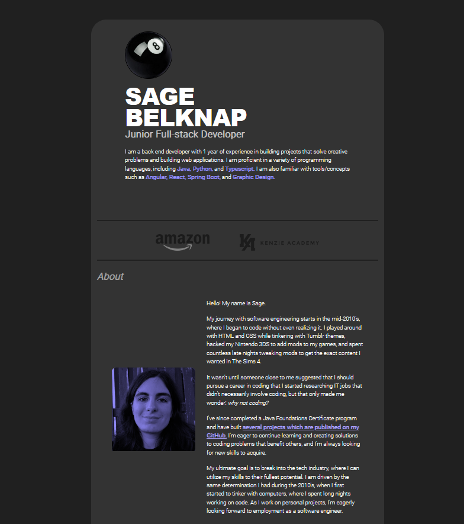

<h1 align="center">Sage Belknap's GitHub Portfolio </h1> 

This is my professional portfolio website that I created from scratch using Angular. The website is hosted on GitHub Pages. This project uses HTML, CSS, and Typescript. I have designed the project beforehand using Figma.

https://8bllgrl.github.io/profile

 
  

## Live Demo

You can view a live demo of this website here: https://8bllgrl.github.io/profile

## 🛠 Installation

To install this website on your local machine, follow these steps:

1. Clone the repository to your local machine using the command `git clone git@github.com:8bllgrl/profile.git`.
2. Navigate to the project directory you have cloned it inside.
3. Install the dependencies using the command `npm install`.
4. Run the development server using the command `ng serve` or `ng serve -o`.
5. To view this website through installation on your local machine, simply navigate to `http://localhost:4200` in your web browser.

## ⚠️‼️ Forking this repo (please read!) ‼️⚠️

If you are interested in using my repository as a starting point for your own project, you are welcome to fork it. However, I want to make it clear that you should not claim my work as your own.

Even if you make minor changes to the project, you must still give credit to me. Please make sure to link back to my GitHub profile and acknowledge me as the original creator.

It is important to note that my portfolio is an original design that I created from start to finish. I did not follow any tutorials, and this is my own original website design. Therefore, if you decide to clone my portfolio, you cannot claim it as your own, or that you yourself designed it.

A significant amount of effort and creativity was put into this project by myself alone to build an original design from start to finish. Please respect the time and effort that I put into creating this portfolio and give credit where credit is due, because this was not an easy project for me to create from scratch.

### TL;DR

Yes, you can fork this repo. However, it is REQUIRED that you must give me proper credit by linking back to [https://github.com/8bllgrl](https://github.com/8bllgrl).

## Features

This website includes the following features:

- Home page with information about me and my skills
- Portfolio page with my projects and their descriptions
- Contact page with a contact form and my contact information
- Responsive design that works on different devices and screen sizes

## Credits

- [Angular](https://angular.io/)
- [GitHub Pages](https://pages.github.com/)

### Inspiration:

- [Brittany Chiang](https://brittanychiang.com/)
